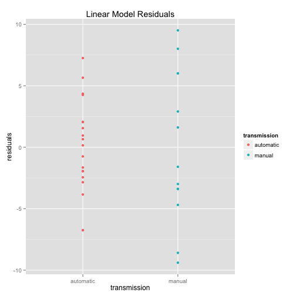

#Executive Summary
This report presents the findings of the data analysis of the mtcars dataset. Specifically, the analysis is concerned with the question of whether the car transmission type (automatic or manual) has an impact in the fuel efficiency (Miles Per Gallon - MGP). Also, the analysis intends to quantify the MGP difference between automatic and manual transmission cars.

An exploratory data analysis is presented in which a boxplot chart of the MPG vs the transmission type of the cars shows that there is a clear impact of the transmission type in the MPG.

Finally, building a linear regression model, it is shown that the manual transmission cars in average has a better fuel efficiency as that of the automatic transmission cars.

#Loading and Transforming the Data
The data used for this analysis comes from the R mtcars dataset. A new variable named **transmission** is added in order to visualize easily the type of transmission of each car in the dataset:


```r
require(knitr)
require(dplyr)
require(ggplot2)
data(mtcars)
mtcars <- mutate(mtcars, transmission = ifelse(am==0,"automatic","manual"))
```

#Exploratory Data Analysis
The following chart serves to visualize the possible relationship between the car transmission type and the fuel efficiency (MPG):


```r
p <- ggplot(mtcars, aes(x = factor(transmission), y = mpg))
p <- p + geom_boxplot(aes(fill = factor(transmission)))
p <- p + xlab("Transmission (manual or automatic)") + ylab("MPG (Miles Per Gallon)") +
        labs(title = "MPG vs Transmission Type")
p
```

 

As the previous chart shows, there is an apparent relationship between the car transmission type and the fuel efficiency. The evidence analyzed so far indicates that the manual transmission cars have in average a higher fuel efficiency as that of the automatic transmission cars. 

#Linear Models
The first model fitted in this analysis has MPG as the outcome and the factor of transmission type as the regressor:

```r
fit1 <- lm(mpg ~ transmission, data = mtcars)
summary(fit1)$coefficients
```

```
##                     Estimate Std. Error   t value     Pr(>|t|)
## (Intercept)        17.147368   1.124603 15.247492 1.133983e-15
## transmissionmanual  7.244939   1.764422  4.106127 2.850207e-04
```

```r
co1 <- summary(fit1)$coefficients
b0_1 <- co1[1,1]
b1_1 <- co1[2,1]
autoCI <- b0_1 + c(-1,1) * pt(.975, df=fit1$df)*co1[1,2]
autoCI
```

```
## [1] 16.21246 18.08227
```

```r
manualCI <- b1_1 + c(-1,1) * pt(.975, df=fit1$df)*co1[2,2]
manualCI
```

```
## [1] 5.778138 8.711741
```

For this model, the hypothesis of whether the model factors are 0 vs the model factors are different from 0 can be tested calculating the 95% confidence interval.

As it can be observed from the confidence interval calculation of the last R code chunk, neither of the intervals include zero, so the model factors must be different from zero and the estimates of 17.15 for **$\beta{0}$** and 7.24 for **$\beta{1}$** must be correct. 

##Comparison with other Linear Models
As variables other than transmission type might have an impact in the MPG, the following model is calculated in order to compare it with the first model built before:


```r
summary(lm(mpg ~ transmission + factor(cyl) + wt + gear + carb, data = mtcars))$coefficients
```

```
##                      Estimate Std. Error    t value     Pr(>|t|)
## (Intercept)        31.2644385  6.0569110  5.1617794 2.453612e-05
## transmissionmanual  1.4487343  1.7670191  0.8198747 4.200359e-01
## factor(cyl)6       -2.9265462  1.7077452 -1.7136902 9.896078e-02
## factor(cyl)8       -4.7320831  2.0610098 -2.2960022 3.033501e-02
## wt                 -2.4945677  1.0214712 -2.4421323 2.201292e-02
## gear                0.2961239  1.4129349  0.2095807 8.356935e-01
## carb               -0.7531386  0.5800896 -1.2983141 2.060293e-01
```

Even though the other factors besides the transmission type has an influence in the outcome (the MPG), still the manual transmission has a better fuel efficiency in this model than that of the automatic transmission. So, it can be concluded that the transmission type is a strong predictor of the MPG.

#Answering the Question About Whether the Transmission Type Impacts the Fuel Efficient
The Exploratory Data Analysis supports the hypothesis that the transmission type has an impact in the fuel efficiency. For instance and in average, the manual transmission cars has a higher MPG than that of the automatic transmission cars. 

**The manual transmission cars are 7.24 miles per gallon more efficient than the automatic transmission cars.** This conclusion is supported by the first model calculated with MPG as the outcome and transmission type as the predictor. That model has the following form:

**$$ Y = \beta{0} + \beta{1}X1$$ =>** 
**$$ Y = 17.15 + 7.24X1$$** 
where X1 is 0 if the car is automatic and 1 if the car is manual, Y = car MPGs, $\beta{0}$ is the intercept and also the estimated MPG for automatic cars and $\beta{1}$ is the difference in MGP between automatic and manual transmission cars.

#Residuals Calculation
From the first model calculated with MPG as an outcome and transmission type as the regressor, the residual calculation and plotting is as follow:

```r
e = resid(fit1)
mypoints <- data.frame(transmission = mtcars$transmission, residuals = e)
ep <- ggplot(mypoints, aes(x = transmission, y = residuals))
ep <- ep + geom_point(aes(colour = transmission)) + labs(title = "Linear Model Residuals")
ep
```

 

It can be observed that there is not a pattern in the residuals.
