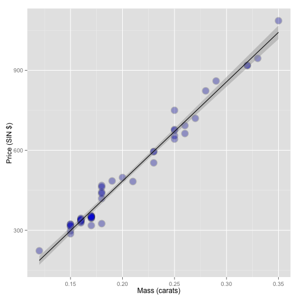

#Building a Linear Model


```r
library(UsingR)
data(diamond)
library(ggplot2)
g = ggplot(diamond, aes(x = carat, y = price))
g = g + xlab("Mass (carats)")
g = g + ylab("Price (SIN $)")
g = g + geom_point(size = 6, colour = "black", alpha=0.2)
g = g + geom_point(size = 5, colour="blue", alpha=0.2)
g = g + geom_smooth(method = "lm", colour="black")
g
```

 
