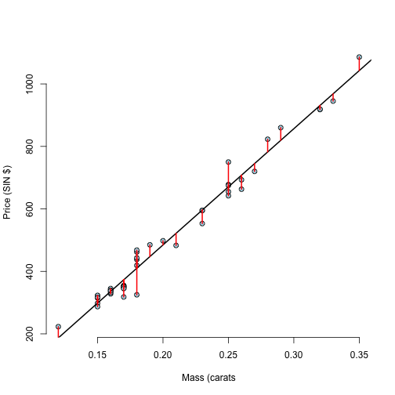
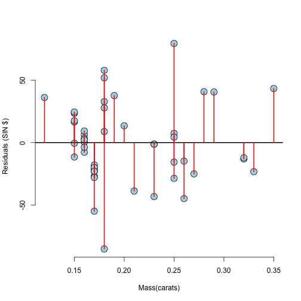

#Building a Linear Model


```r
library(UsingR)
data(diamond)
library(ggplot2)
g = ggplot(diamond, aes(x = carat, y = price))
g = g + xlab("Mass (carats)")
g = g + ylab("Price (SIN $)")
g = g + geom_point(size = 6, colour = "black", alpha=0.2)
g = g + geom_point(size = 5, colour="blue", alpha=0.2)
g = g + geom_smooth(method = "lm", colour="black")
g
```

 

##Now let's build the model "manually"


```r
fit <- lm(price ~ carat, data = diamond)
summary(fit)
```

```
## 
## Call:
## lm(formula = price ~ carat, data = diamond)
## 
## Residuals:
##     Min      1Q  Median      3Q     Max 
## -85.159 -21.448  -0.869  18.972  79.370 
## 
## Coefficients:
##             Estimate Std. Error t value Pr(>|t|)    
## (Intercept)  -259.63      17.32  -14.99   <2e-16 ***
## carat        3721.02      81.79   45.50   <2e-16 ***
## ---
## Signif. codes:  0 '***' 0.001 '**' 0.01 '*' 0.05 '.' 0.1 ' ' 1
## 
## Residual standard error: 31.84 on 46 degrees of freedom
## Multiple R-squared:  0.9783,	Adjusted R-squared:  0.9778 
## F-statistic:  2070 on 1 and 46 DF,  p-value: < 2.2e-16
```

```r
coef(fit)
```

```
## (Intercept)       carat 
##   -259.6259   3721.0249
```

###Interpretation of the model
The B1 coeficient of 3721, means that for each increase of one carat in the diamond mass we **"expect"** and increase of 3721 SIN $ in the price.

The B0 coeficient of -259 is not of "much interest", because that is the expected price of a diamond of "cero" mass.

###Now let's get a more interpretable interception point of the model by shifting it by the mean of the predictor


```r
# if one wants to do arimetic operations inside a variable of the lm function one has to use the I function
fit2 <- lm(price ~ I(carat - mean(carat)), data = diamond)
coef(fit2)
```

```
##            (Intercept) I(carat - mean(carat)) 
##               500.0833              3721.0249
```

```r
mean(diamond$carat)
```

```
## [1] 0.2041667
```

When we shift the model by a factor equal to the mean of the diamonds mass we get a new B0 factor of 500. That means that for a diamond of an average mass we exect a price of 500$.

###Now let's scale the model by multiplying the predictor by a factor of 10


```r
fit3 <- lm(price ~ I(carat * 10), data = diamond)
coef(fit3)
```

```
##   (Intercept) I(carat * 10) 
##     -259.6259      372.1025
```

We see that when we multiply the predictor by a factor we get a new B1 that is equal to the original B1 divided by the factor.

##Pricting the value of Y using the lm model

Let's say we have a set of diamons masses newx <- c(0.16, 0.27, 0.34)


```r
newx <- c(0.16, 0.27, 0.34)
b0 <- coef(fit)[1]
b1 <- coef(fit)[2]
newy <- b0 + b1*newx
newy
```

```
## [1]  335.7381  745.0508 1005.5225
```

We can also use the "predict" function. This function takes a statistical model and uses it to predict the outcome.


```r
# predict can use several models. The predictor's values must be passed as a data frame
predict(fit, newdata= data.frame(carat = newx))
```

```
##         1         2         3 
##  335.7381  745.0508 1005.5225
```

```r
# if we ommit the predictor's values the function evaluates the model with the original predictor values


#Caculating Residuals
```

```r
data(diamond)
y <- diamond$price; x <- diamond$carat; n <- length(y)
fit <- lm(y ~ x)
e <- resid(fit) #resid calculates the residual of a linear model
yhat <- predict(fit) #predict calculates the predicted values of a linear model
max(abs(e - (y - yhat)))
```

```
## [1] 9.485746e-13
```

```r
max(abs(e - (y - coef(fit)[1] - coef(fit)[2] * x)))
```

```
## [1] 9.485746e-13
```

```r
#the sum of the residuals is zero
sum(e)
```

```
## [1] -1.865175e-14
```

```r
#the sum of the residuals multiplied by X is zero
sum(e*x)
```

```
## [1] 6.959711e-15
```

```r
#the mean of the residuals is also zero
mean(e)
```

```
## [1] -3.885781e-16
```

We calculated the residual using the resid function and also we calculated it manually using our linear model. We can see that we got the same results.

The sum of the residuals is zero.
The sum of the residuals multiplied by x is also zero.
The mean of the residuals is also zero.

##Plotting the residuals


```r
plot(diamond$carat, diamond$price,
     xlab= "Mass (carats",
     ylab= "Price (SIN $)",
     bg = "lightblue",
     col = "black", cex = 1.1, pch = 21, frame = FALSE)
abline(fit, lwd = 2)
for(i in 1:n)
        lines(c(x[i],x[i]), c(y[i],yhat[i]), col="red",lwd=2)
```

 

Each red line is a residual of the model.

Now, let's plot the residuals agaist the carat.

```r
plot(x,e,
     xlab="Mass(carats)",
     ylab="Residuals (SIN $)",
     bg = "lightblue",
     col = "black", cex = 2, pch = 21, frame = FALSE)
abline(h = 0, lwd=2)
for(i in 1:n)
        lines(c(x[i],x[i]), c(e[i],0), col="red",lwd=2)
```

 

#Residual Variance

```r
y <- diamond$price; x <- diamond$carat; n <- length(y)
fit <- lm(y ~ x)
summary(fit)$sigma
```

```
## [1] 31.84052
```

```r
#calculating the variance (sigma squared) using the formula
sqrt(sum(resid(fit)^2)/(n-2))
```

```
## [1] 31.84052
```

The sigma gives you the value of the variance of the residuals.

#Variance of Beta1 and Beta0

```r
library(UsingR); data(diamond)
y <- diamond$price; x <- diamond$carat; n <- length(y)
beta1 <- cor(y,x)*sd(y)/sd(x)
beta0 <- mean(y) - beta1 * mean(x)
e <- y - beta0 - beta1*x
sigma2 <- sum(e^2)/(n-2)
sigma <- sqrt(sigma2)
#sum of squares of x
ssx <- sum((x-mean(x))^2)
seBeta0 <- sqrt((1/n + mean(x)^2/ssx) * sigma2)
seBeta1 <- sqrt(sigma2/ssx)
tBeta0 <- beta0/seBeta0 ; tBeta1 <- beta1/seBeta1
#pt is the R function that calculates the t probability
pBeta0 <- 2 * pt(abs(tBeta0), df = n - 2, lower.tail = FALSE)
pBeta1 <- 2 * pt(abs(tBeta1), df = n - 2, lower.tail = FALSE)
coefTable <- rbind(c(beta0, seBeta0, tBeta0, pBeta0),
                   c(beta1, seBeta1, tBeta1, pBeta1))
colnames(coefTable) <- c("Estimate", "Std. Error", "t value", "P(>|t|)")
rownames(coefTable) <- c("(Intercept)", "x")
coefTable
```

```
##              Estimate Std. Error   t value      P(>|t|)
## (Intercept) -259.6259   17.31886 -14.99094 2.523271e-19
## x           3721.0249   81.78588  45.49715 6.751260e-40
```

Now, comparing the last result with calculating the same coefficients using the R linear model function:


```r
fit <- lm(y ~ x)
summary(fit)$coefficients
```

```
##              Estimate Std. Error   t value     Pr(>|t|)
## (Intercept) -259.6259   17.31886 -14.99094 2.523271e-19
## x           3721.0249   81.78588  45.49715 6.751260e-40
```

```r
summary(fit)
```

```
## 
## Call:
## lm(formula = y ~ x)
## 
## Residuals:
##     Min      1Q  Median      3Q     Max 
## -85.159 -21.448  -0.869  18.972  79.370 
## 
## Coefficients:
##             Estimate Std. Error t value Pr(>|t|)    
## (Intercept)  -259.63      17.32  -14.99   <2e-16 ***
## x            3721.02      81.79   45.50   <2e-16 ***
## ---
## Signif. codes:  0 '***' 0.001 '**' 0.01 '*' 0.05 '.' 0.1 ' ' 1
## 
## Residual standard error: 31.84 on 46 degrees of freedom
## Multiple R-squared:  0.9783,	Adjusted R-squared:  0.9778 
## F-statistic:  2070 on 1 and 46 DF,  p-value: < 2.2e-16
```

Now, let's calculate a t confidence interval for the factors beta0 and beta1:


```r
sumCoef <- summary(fit)$coefficients #grabing the coefficients from the linear model
sumCoef
```

```
##              Estimate Std. Error   t value     Pr(>|t|)
## (Intercept) -259.6259   17.31886 -14.99094 2.523271e-19
## x           3721.0249   81.78588  45.49715 6.751260e-40
```

```r
#calculating conf interval for beta0
sumCoef[1,1] + c(-1,1) * qt(.975, df = fit$df) * sumCoef[1,2]
```

```
## [1] -294.4870 -224.7649
```

```r
#calculating conf interval for beta1
sumCoef[2,1] + c(-1,1) * qt(.975, df = fit$df) * sumCoef[2,2]
```

```
## [1] 3556.398 3885.651
```

In our example (the diamond prices example), the second interval over beta1, is the interval over the slope of the model. The interpretation is that for each one carat variation in the diamond mass, there will be a variation in the price of $3556 to $3885, and we can say this with 95% confidence (because we calculated the 95% confidence interval).

As variations of one carats are to large in our example, we can calculate the interval dividing it by 10:


```r
(sumCoef[2,1] + c(-1,1) * qt(.975, df = fit$df) * sumCoef[2,2])/10
```

```
## [1] 355.6398 388.5651
```

So, we get the price variation interval for changes in 0.1 carats in mass.


