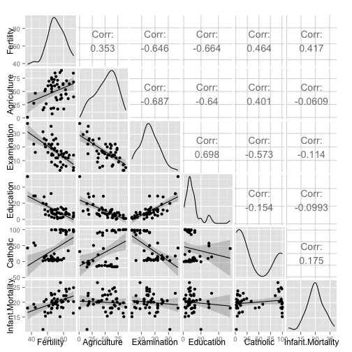

#Multivariable Regression

##Loading the data

```r
require(datasets)
data(swiss)
require(GGally) #this library provides some additional plots types to ggplot2
```

```
## Loading required package: GGally
```

```r
require(ggplot2)

g = ggpairs(swiss, lower = list(continuous = "smooth"), params = c(method = "looess"))
g
```

 

##Fit all of the variable in the same Linear Model


```r
summary(lm(Fertility ~ ., data = swiss))$coefficients
```

```
##                    Estimate  Std. Error   t value     Pr(>|t|)
## (Intercept)      66.9151817 10.70603759  6.250229 1.906051e-07
## Agriculture      -0.1721140  0.07030392 -2.448142 1.872715e-02
## Examination      -0.2580082  0.25387820 -1.016268 3.154617e-01
## Education        -0.8709401  0.18302860 -4.758492 2.430605e-05
## Catholic          0.1041153  0.03525785  2.952969 5.190079e-03
## Infant.Mortality  1.0770481  0.38171965  2.821568 7.335715e-03
```

##Interpretation of the coefficients
For example, look at the coefficient for Agriculture. It is -0.17. We can interpret it as: **our model estimates an expected 0.17 decrease in standarized fertility for every 1% increase in percentage of males involved in agriculture in holding the remaining variables constant.***

##What happen if we take only one of the variables as a predictor of the Ferlity
For example, let's fit the model taking only the variable Agriculture as the regressor:


```r
summary(lm(Fertility ~ Agriculture, data = swiss))$coefficients
```

```
##               Estimate Std. Error   t value     Pr(>|t|)
## (Intercept) 60.3043752 4.25125562 14.185074 3.216304e-18
## Agriculture  0.1942017 0.07671176  2.531577 1.491720e-02
```

Now Agriculture has a positive correlation with fertility. This conclusion might be wrong.

